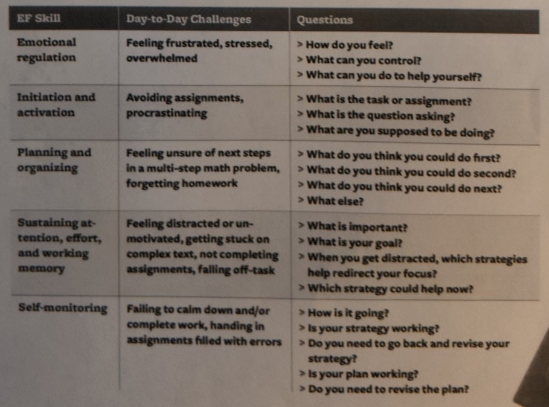
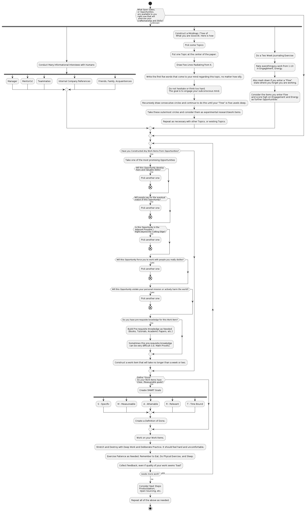
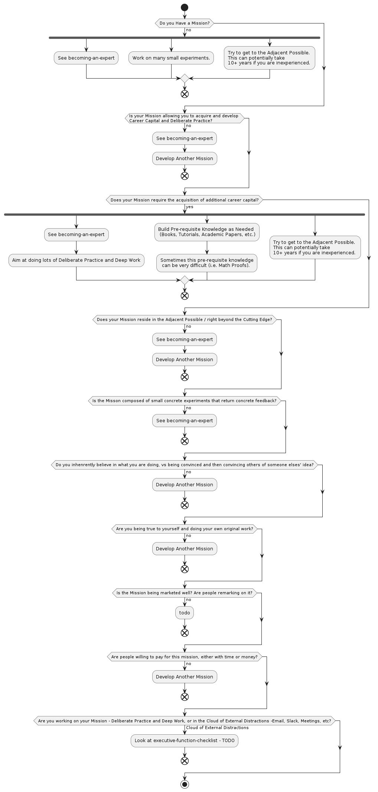

# lifehacking-tools

## Overview

Welcome to my Lifehacking Tools repo, with advice from many excellent sources.

As a Software Engineer, I tend to like to stay focused and on task. 

As such while I love to read lifehacking books and blogs with tons of anecdotes, I also like checklists and flowcharts. 

Therefore, I have created several flowcharts that I find useful, professionaly and personally.

Feel free to use them yourself and modify them for your needs, but I'd recommend reading through the References below, so you can develop your own personal flowcharts.

**TIP: Some of these flowcharts are large - Right Click and Open Image in New Tab.**

## Table of Contents

* [Core Life Hacking](#core-life-hacking)
    * [Focusing Stratgies and Executive Functioning Skills](#focusing-stratgies-and-executive-functioning-skills)
    * [Finding Quality Sources of Information](#finding-quality-sources-of-information)
* [Becoming An Expert](#becoming-an-expert)
    * [Deep Work and Deliberate Practice Checklist](#deep-work-and-deliberate-practice-checklist)
    * [Finding Opportunities, Open Doors and Important Things to Work On](#finding-opportunities-open-doors-and-important-things-to-work-on)
    * [How to Build a High Level Mission](#how-to-build-a-high-level-mission)
* [Software and Product Engineering](#software-and-product-engineering)
    * [Legacy Code Strategic Checklist](#legacy-code-strategic-checklist)
    * [Product Management Overview Map aka "Toolkit for Maximizing Successful Implementations"](#product-management-overview-map-aka-toolkit-for-managing-successful-implementations)
    * [Code Quality Checklist](#code-quality-checklist)
    * [Production Checklist](#production-checklist)
* [Building the flowcharts](#building-the-flowcharts)
* [References](#references)

## Core Life Hacking

### Focusing Stratgies and Executive Functioning Skills

Image sourced from Cohen, Richard K. *ADDitude Magazine*. 
### Finding Quality Sources of Information

TODO - this is almost a skill / full time job in and of itself... the modern librarian!

## Becoming An Expert

### Deep Work and Deliberate Practice Checklist

TODO - "Deep Work"

### Finding Opportunities, Open Doors and Important Things to Work On

### How to Build a High Level Mission

## Software and Product Engineering

### Legacy Code Strategic Checklist

TODO - "Working Effectively with Legacy Code"

### Product Management Overview Map aka "Toolkit for Managing Successful Implementations"

TODO - A.C's Deck and "Inspired" by Cagan

## Code Quality Checklist

TODO - Code Complete, Pragmatic Programmer

## Production Checklist

TODO - Code Complete, SRE Workbook

## Building the flowcharts

* Install Docker
* Run `generate-flowcharts.sh`
* You should see png files get laid down in this directory.

## References

Burnett, Bill and Evans, Dave (2020). *Designing Your Life.* Alfred A. Knopf.

Cohen, Richard K. "A Daily Plan to Practice Empowering Self-Talk." *ADDitude Magazine* https://www.additudemag.com/metacognition-self-talk-executive-function-adhd/

Newport, Calvin (2012). *So Good They Can't Ignore You.* Grand Central Publishing.

Newport, Calvin (2016). *Deep Work.* Grand Central Publishing.
