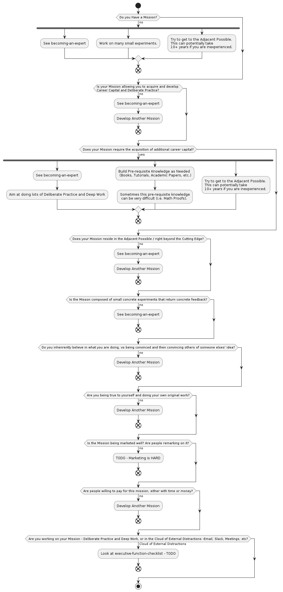

# lifehacking-tools

Welcome to my Lifehacking Tools repo, with advice from many excellent sources.

As a Software Engineer, I tend to like to stay focused and on task. 

As such while I love to read lifehacking books and blogs with tons of anecdotes, I also like checklists and flowcharts. 

Therefore, I have created several flowcharts that I find useful, professionaly and personally.

Feel free to use them yourself and modify them for your needs, but I'd recommend reading through the References below, so you can develop your own personal flowcharts.

**TIP: Some of these flowcharts are large - Right Click and Open Image in New Tab.**

## Building the flowcharts

* Install Docker
* Run `generate-flowcharts.sh`
* You should see png files get laid down in this directory.

# Focusing Stratgies and Executive Functioning Skills

TODO

# Becoming an Expert - Finding Opportunities and Important Things to Work On

# On Building a Mission

# References

Burnett, Bill and Evans, Dave (2020). *Designing Your Life.* Alfred A. Knopf.

Newport, Calvin (2012). *So Good They Can't Ignore You.* Grand Central Publishing.

Newport, Calvin (2016). *Deep Work.* Grand Central Publishing.